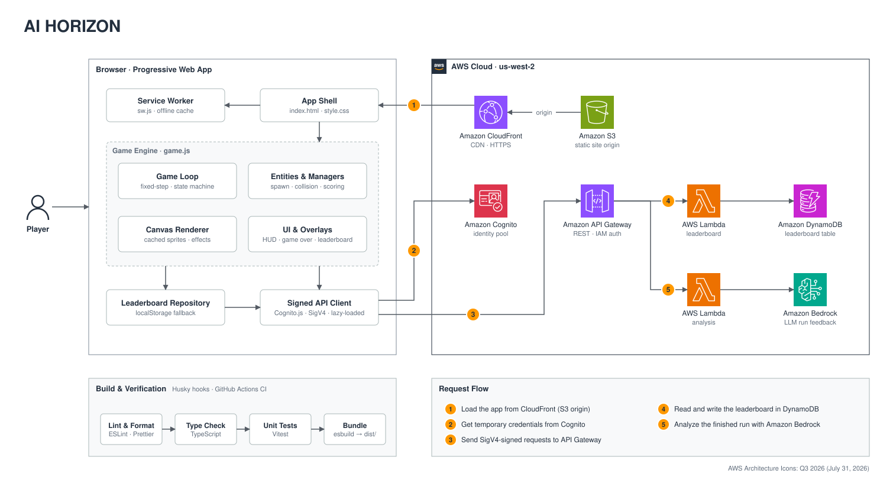

# AI Horizon

AI Horizon is a fast, responsive HTML5 Canvas space shooter built with vanilla JavaScript and ES modules. It combines arcade action, particle-heavy visuals, deterministic seeded runs, and a local/remote leaderboard.

## Quick start

Requirements: Node 20.19+ or 22.12+.

1. Install dependencies: `npm install`
2. Start the dev server: `npm run serve`
3. Open http://localhost:8000

For a production build, run `npm run build` and serve the generated `dist/` folder.

> The game must be served over HTTP because it uses ES modules.

## Current highlights

- Fast gameplay with layered starfields, nebula effects, and asteroid waves
- Hardened planetary asteroids, score popups, and impact effects
- Deterministic runs via `?seed=...`
- Local and optional remote leaderboard support with conflict retry
- PWA-friendly assets and mobile-friendly controls

## Project structure

- `js/` — game loop, entities, managers, systems, adapters, and constants
- `tests/` — Vitest coverage for gameplay logic and edge cases
- `server/lambda/` — example remote leaderboard endpoint
- `docs/` — architecture and supporting documentation

## Development commands

- `npm run serve` — start the dev server
- `npm run build` — create the production bundle
- `npm run test` / `npm run test:watch` — run tests
- `npm run lint` / `npm run lint:fix` — lint and fix issues
- `npm run typecheck` — validate JSDoc-based type checking
- `npm run ci:local` — run the full local verification suite
- `npm run perf:bench -- http://localhost:8000` — headless-Chrome benchmark run (see below)

The production build is an ES module bundle (`dist/bundle.js`, loaded with `<script type="module">`) plus lazily loaded chunks in `dist/chunks/`. The AWS SDK used for the remote leaderboard lives in those chunks and is only downloaded when a signed request is first needed, so the initial download contains game code only.

### Profiling flags

Diagnostics are opt-in via query parameters and cost nothing when absent:

- `?debug=perf` — on-screen frame diagnostics (fps, update/draw ms with p95, entity and pool counts, sprite cache sizes, adaptive performance level, canvas resolution). A JSON session summary is logged to the console at game over.
- `?autoplay=1` — a scripted pilot drives the ship and auto-starts the game, for reproducible profiling runs.

Combine them with a fixed seed for before/after comparisons, e.g. `http://localhost:8000/?seed=12345&debug=perf&autoplay=1`.

`npm run perf:bench -- <url>` automates this: it launches headless Chrome (or Edge) against the URL with those flags, waits for the game-over summary and prints it as JSON. Runs use software rendering, so compare two runs against each other rather than against real-device targets. Node 22+ has the required WebSocket built in; the script passes `--experimental-websocket` for Node 20/21.

## Players

If you are playing the game, the main controls and scoring details are described in `about.html`.

For the best experience:

- open the game in a modern browser
- use a local server when running it from source
- try different seeds with `?seed=...` to explore different runs

For remote leaderboard support, the app should be served over HTTPS in production.

---

Happy hacking!
